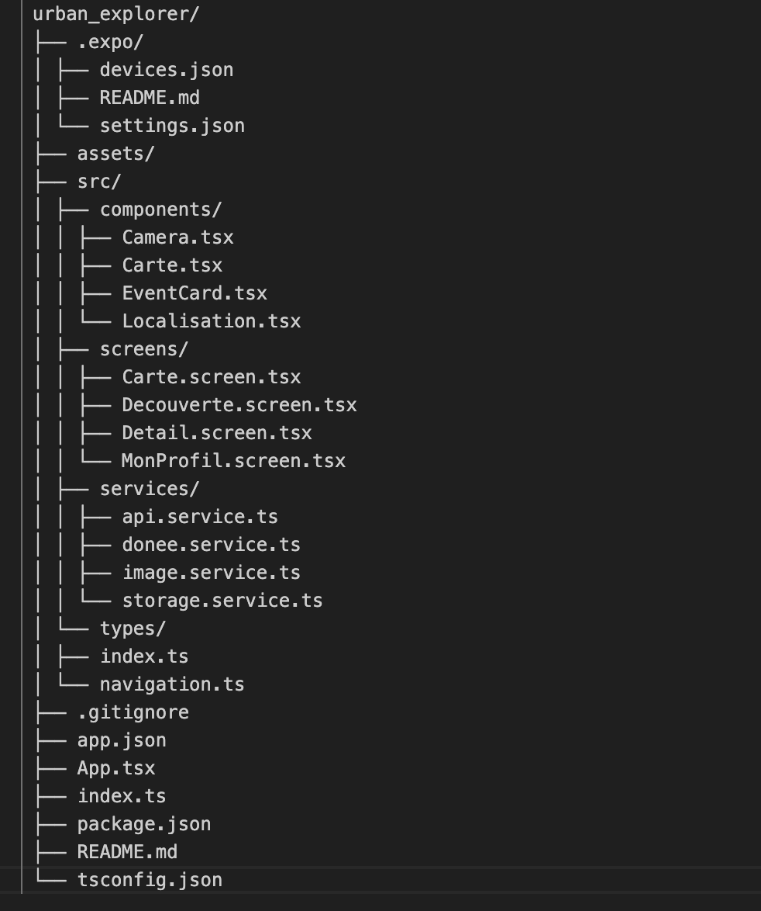

# Urban Explorer

Urban Explorer est une application mobile de type City Guide développée avec React Native et Expo. Elle permet aux utilisateurs de découvrir les événements culturels à Paris, de visualiser les lieux sur une carte interactive, de planifier leurs visites dans leur calendrier, et d’immortaliser leurs explorations en prenant un selfie souvenir directement depuis l’application.

## Groupe de développement:

- Jacqueline MAPENZI
- Danielle Jamila KOAGNE NGANKAM
- Aya SGHAIER

## Architecture globale de l'application

1.  **Arborescence de l'application**
    

2.  **Choix de la navigation**
    Dans cette application, Nous avons utiliser React Navigation avec deux types de navigateurs :

- Bottom Tab Navigator (barre de navigation en bas) pour accéder rapidement aux trois sections principales :

  -- Découverte : Liste des événements culturels.
  -- Carte : Affichage des lieux sur une carte interactive.
  -- Mon Profil : Espace utilisateur pour le selfie souvenir.

- Stack Navigator imbriqué dans l’onglet Découverte pour permettre la navigation entre la liste et le détail d’un événement.

3.  **Découpage des composants**

- src/screens/ : Contient les écrans principaux (pages) :
  -- Decouverte.screen.tsx : Liste des événements.
  -- Detail.screen.tsx : Détail d’un événement.
  -- Carte.screen.tsx : Carte des lieux.
  -- MonProfil.screen.tsx : Profil utilisateur.

- src/components/ : Composants réutilisables :
  -- EventCard : Carte d’un événement.
  -- Carte : Carte avec marqueurs.
  -- Camera : Prise de photo.
  -- Localisation : Affichage de la position de l’utilisateur.

- src/services/ :
  -- api.service: Gère les requêtes HTTP vers l’API open data de Paris avec gestion des erreurs.
  -- storage.service: stockage local.
  -- donee.service: Récupère des points d’intérêt depuis l’API selon un nom donné.
  -- image.service: Ce service fournit une fonction qui retourne une URL d’image aléatoire depuis picsum.photos

- src/types/ : Définition des types TypeScript pour la sécurité et la clarté du code
  -- index: Définit les types et interfaces des données principales de l’application.
  -- navigation: Définit les types de navigation et les paramètres des routes pour la navigation entre les écrans.

## Explication de l'intégration de l'API

1.  **Gestion des requêtes API**

L’application utilise le service api.service pour centraliser les appels HTTP vers l’API Open Data de Paris. Ce service utilise axios et gère :

- La configuration de l’URL de base et des en-têtes.
- Les logs des requêtes et des réponses pour le debug. (interceptors)
- La gestion des erreurs réseau (affichage d’alertes en cas d’échec). (interceptors)

2.  **Gestion de l’état des données**

Chaque écran qui consomme l’API gère son propre état local Chargement (isLoading), Erreur (error) et Données.

Nous avons utilisé:

- useState pour stocker les données récupérées depuis l’API (par exemple, la liste des événements ou des lieux), l’état de chargement (loading/isLoading), les messages d’erreur, et les valeurs saisies par l’utilisateur (comme la recherche ou les dates sélectionnées).

- useEffect pour déclencher la récupération des données dès que le composant est monté, ou lorsqu’une dépendance change (par exemple, pour lancer un appel API au chargement de la page).

- useMemo pour optimiser le filtrage ou le calcul de données dérivées, comme la liste filtrée des événements selon la recherche de l’utilisateur, afin d’éviter des recalculs inutiles.

- useRef pour stocker des valeurs persistantes qui ne doivent pas provoquer de re-render, comme une valeur d’animation pour un effet visuel.

## détail de l'implémentation des trois composants natifs

1.  **Localisation et Carte**

- Implémentation:

Sur l’écran "Carte" (Carte.screen.tsx), un composant MapView (Carte.tsx) affiche la carte centrée sur Paris.
Les lieux récupérés depuis l’API sont parcourus pour placer des Marker avec leurs coordonnées.
Un clic sur un marqueur affiche le nom du lieu.

- Difficultés rencontrées :

Format des coordonnées parfois absent ou incorrect dans les données API.
Problèmes d’affichage sur certains appareils (carte blanche ou non centrée).
Gestion du centrage initial sur Paris.

- Permissions demandées :

Pour la géolocalisation de l’utilisateur (dans Localisation.tsx), permission d’accès à la localisation via expo-location.

- Solutions apportées :

Filtrage des lieux sans coordonnées.
Valeurs par défaut pour centrer la carte sur Paris.
Gestion des erreurs et affichage d’un message si la permission est refusée.

2.  **Le Calendrier**

- Implémentation :

Sur l’écran de détail (Detail.screen.tsx), un DateTimePicker natif permet de choisir une date et une heure pour planifier une visite.
L’événement est ensuite ajouté au calendrier de l’utilisateur via expo-calendar.

- Difficultés rencontrées :

Installation du module natif et compatibilité avec Expo.
Permissions parfois refusées ou non demandées correctement.
Différences d’affichage entre Android et iOS.

- Permissions demandées :

Permission d’accès au calendrier via expo-calendar.

- Solutions apportées :

Demande explicite de la permission au montage de l’écran.
Affichage d’un message d’erreur si la permission est refusée.
Utilisation de modals pour un affichage cohérent sur toutes les plateformes.

3.  **La Caméra**

- Implémentation :
  Sur l’écran "Mon Profil" (MonProfil.screen.tsx), le composant Camera permet de prendre un selfie.
  La photo prise est affichée comme avatar et sauvegardée localement.

- Difficultés rencontrées :

Permission d’accès à la caméra parfois refusée.
Gestion de l’état de la caméra (affichage, fermeture, animation).
Problèmes d’affichage sur certains appareils.

- Permissions demandées :

Permission d’accès à la caméra via expo-camera.

- Solutions apportées :

Demande de permission dès l’ouverture de l’écran.
Affichage d’un message et d’un bouton pour demander la permission si besoin.
Sauvegarde et affichage immédiat de la photo prise.

## Les bonus réalisés.

1.  **Sauvegarde locale**

- Implémenté dans : storage.service.ts, MonProfil.screen.tsx, Detail.screen.tsx

- Fonctionnalité :
  La photo de profil prise avec la caméra est sauvegardée localement et restaurée à l’ouverture de l’app.
  Les visites planifiées dans le calendrier sont aussi sauvegardées localement.

- Hooks utilisés :
  useEffect : pour charger la photo de profil sauvegardée au démarrage du profil.
  useState : pour stocker l’URI de la photo et les visites planifiées.

2.  **Barre de recherche / Filtre**

- Implémenté dans : Decouverte.screen.tsx

- Fonctionnalité :
  Champ de recherche en haut de l’écran Découverte.
  Filtre la liste des événements en temps réel selon le texte saisi.

- Hooks utilisés :
  useState : pour stocker la valeur de recherche.
  useMemo : pour optimiser le filtrage de la liste selon la recherche.

3.  **Gestion de l'UI/UX (ActivityIndicator)**

- Implémenté dans : Decouverte.screen.tsx, Carte.screen.tsx, Localisation.tsx

- Fonctionnalité :
  Affiche un indicateur de chargement pendant les appels API ou la récupération de la position.

- Hooks utilisés :
  useState : pour gérer l’état de chargement (loading, isLoading).
